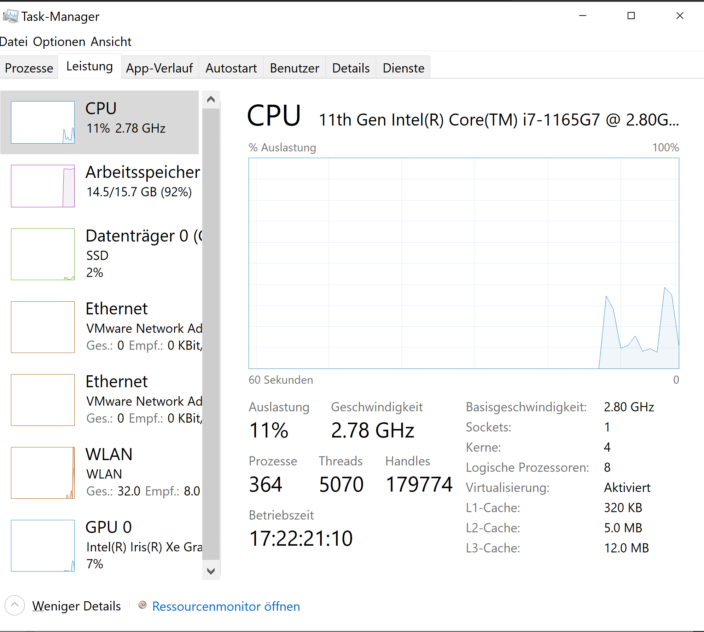
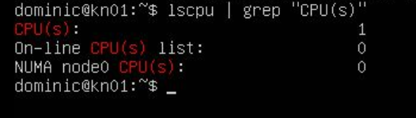
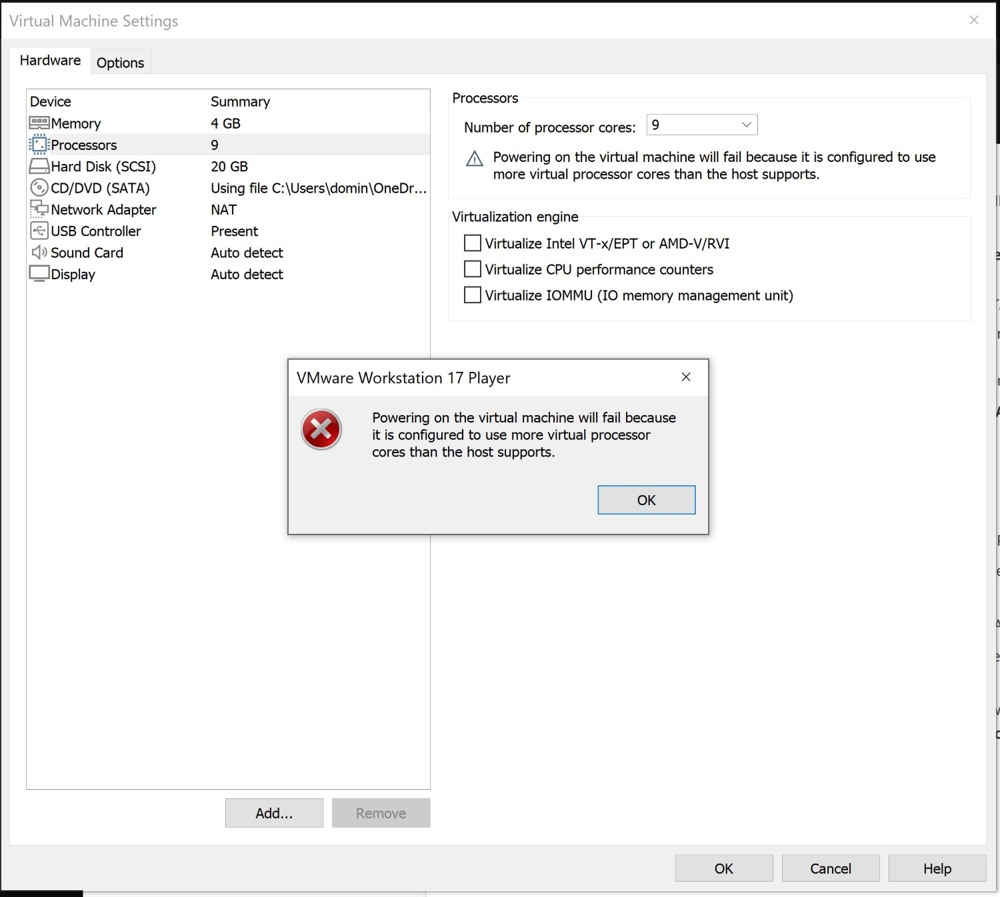

## Aufgabe A: Hypervisor Typ 1 und Typ 2

### Was ist ein Hypervisor?
Ein Hypervisor ist eine Software oder Firmware, die es ermöglicht, mehrere Betriebssysteme (sogenannte "virtuelle Maschinen") auf einem einzigen physischen Rechner gleichzeitig auszuführen. Der Hypervisor verwaltet die Ressourcen des Host-Systems und verteilt sie auf die virtuellen Maschinen.

### Unterschiede zwischen Hypervisor Typ 1 und Typ 2

1. **Hypervisor Typ 1 ("Bare-Metal")**
   - Wird direkt auf der Hardware installiert, ohne ein darunterliegendes Betriebssystem.
   - **Beispiele:** VMware ESXi, Microsoft Hyper-V, Xen.
   - **Vorteil:** Bessere Leistung und Effizienz, da keine zusätzliche Schicht zwischen Hardware und Hypervisor liegt.

2. **Hypervisor Typ 2 ("Hosted")**
   - Läuft als Anwendung innerhalb eines vorhandenen Betriebssystems (Host-Betriebssystem).
   - **Beispiele:** VMware Workstation, VirtualBox, Parallels Desktop.
   - **Vorteil:** Einfache Installation und Nutzung auf Standard-PCs.  
   - **Nachteil:** Etwas geringere Performance, da ein zusätzliches Betriebssystem zwischen Hypervisor und Hardware liegt.

---

## Aufgabe B: Virtualisierungssoftware

### 1. Vermutung des Hypervisor Typs
- **Verwendete Software:** VirtualBox  
- **Vermutung:** VirtualBox ist ein **Hypervisor Typ 2**, da es auf einem vorhandenen Host-Betriebssystem (z.B. Windows oder Linux) läuft.

---

### 2. Test der Ressourcenlimits

#### a) Überprüfung der Host-System-Ressourcen
**Befehle:**
```bash
lscpu | grep "CPU(s)"
free -h




