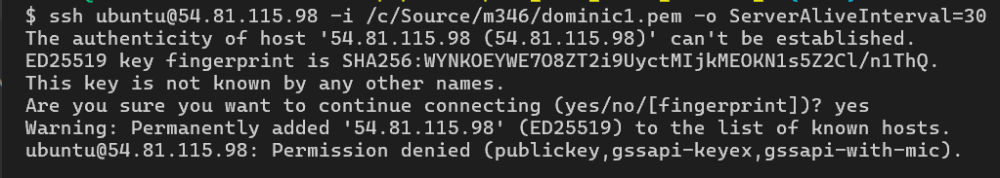
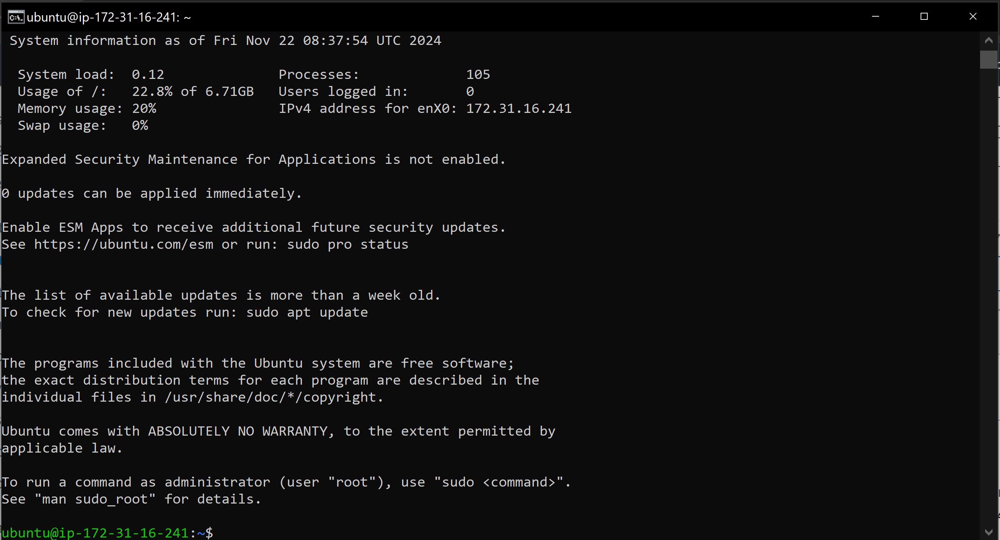
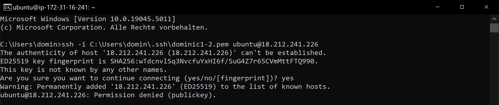

# KN02: IaaS - Virtuelle Server

In diesem Kompetenznachweis (KN) setzen Sie sich mit Infrastructure as a Service (IaaS) in AWS auseinander. Dabei lernen Sie, wie man virtuelle Server (Instanzen) erstellt, verwaltet und über SSH darauf zugreift.

---

## Lernziele

1. Erste Schritte mit IaaS in AWS.
2. Umgang mit AWS und virtuellen Servern (Instanzen).
3. Verständnis und Nutzung von SSH-Schlüsseln für den Zugriff auf virtuelle Server.

---

### **B) Instanz erstellen (40%)**

#### **Parameter für die Instanz:**
- **Name:** Frei wählbar (z. B. `KN02`).
- **OS Image:** Ubuntu 24.04.
- **Instanz-Typ:** `t2.micro`.
- **Key-Pair:** 
  - Erstellen Sie zwei neue Key-Paare (`vorname1` und `vorname2`).
  - Wählen Sie das Key-Pair `vorname1` für die Instanz aus.
- **Weitere Einstellungen:** Standard belassen.

#### **Abgabe:**
1. Screenshot der **Instanz-Liste**, in dem folgende Details sichtbar sind:
   - Öffentliche IP-Adresse.
2. Kurze Beschreibung der Einstellungen Ihrer Instanz:
   - Diskgröße.
   - Betriebssystem.
   - RAM-Größe.
   - Anzahl der CPUs.

---

### **C) Zugriff mit SSH-Key (40%)**

#### **Schritte:**






   ```bash
   ssh -i /pfad/zum/vorname1.pem ubuntu@<public-ip>


