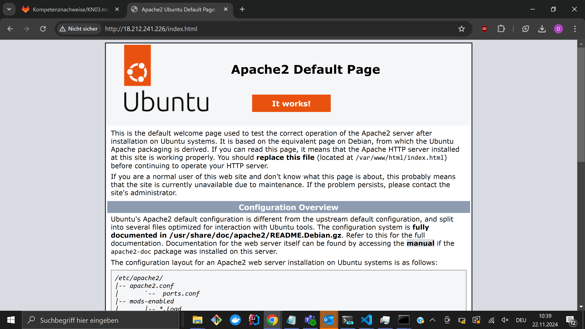
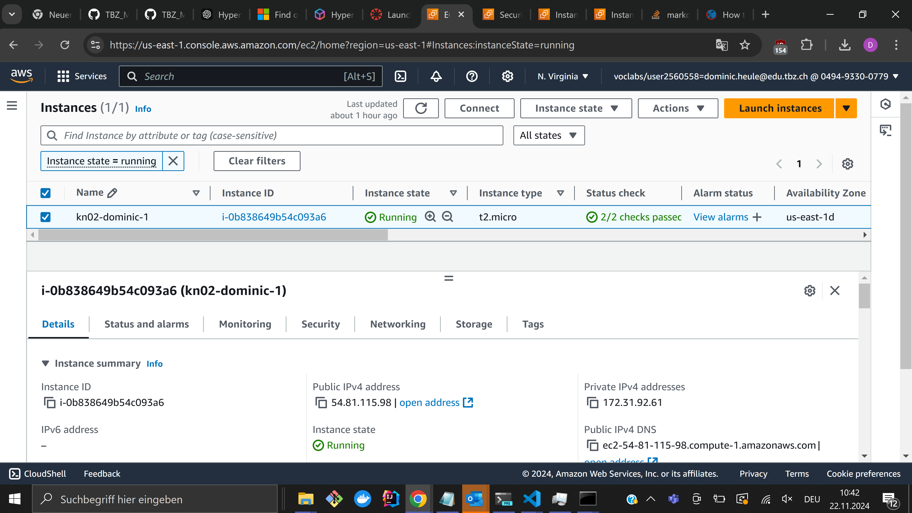
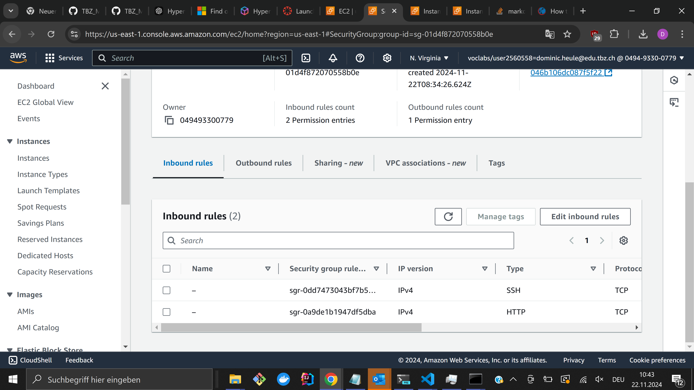
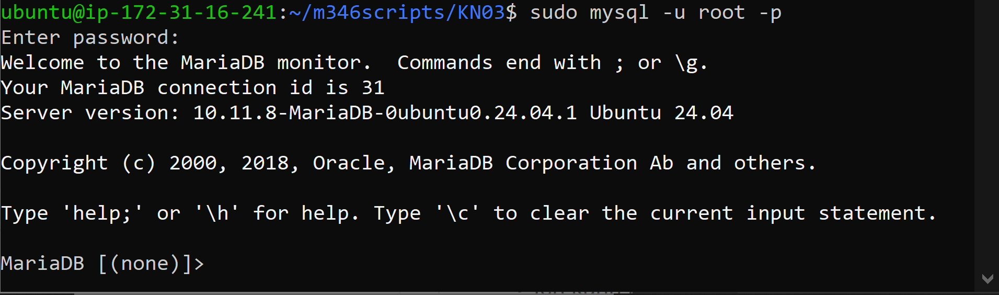

# KN03






# MySQL-Login: Kurze Erklärung

Dieser Befehl ermöglicht den Zugriff auf die MySQL-Datenbank über die Kommandozeile. 

## Befehl

```bash
sudo mysql -u root -p

```


## Erklärung der einzelnen Teile:

sudo: Führt den Befehl mit Administratorrechten aus. Dies ist notwendig, um administrative Aufgaben auszuführen.

mysql: Startet die MySQL-Command-Line Interface (CLI), ein Werkzeug, um direkt mit MySQL-Datenbanken zu interagieren.

-u root: Gibt den Benutzer an, der sich anmelden möchte. Der Benutzer root hat in der Regel vollständige Administratorrechte für die MySQL-Datenbank.

-p: Fordert nach der Eingabe des Befehls ein Passwort an. Dieses Passwort ist notwendig, um sich als Benutzer root zu authentifizieren.