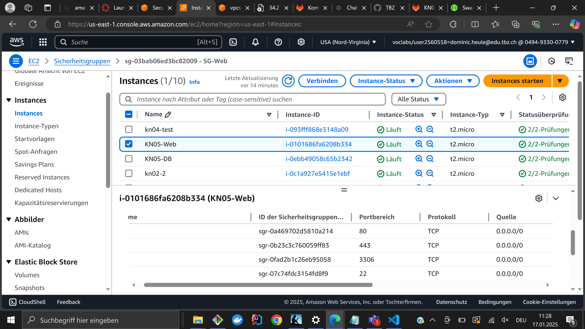
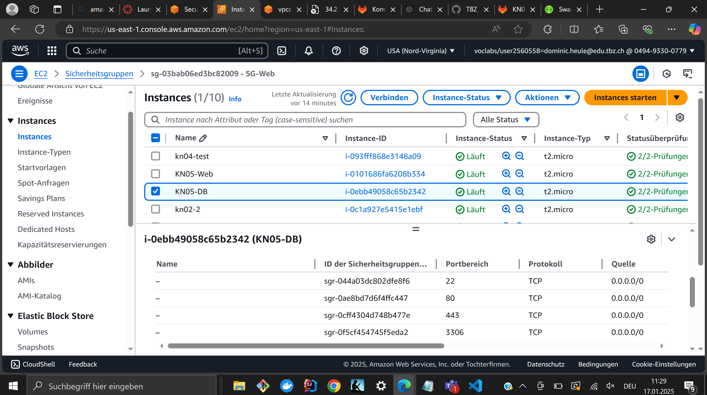
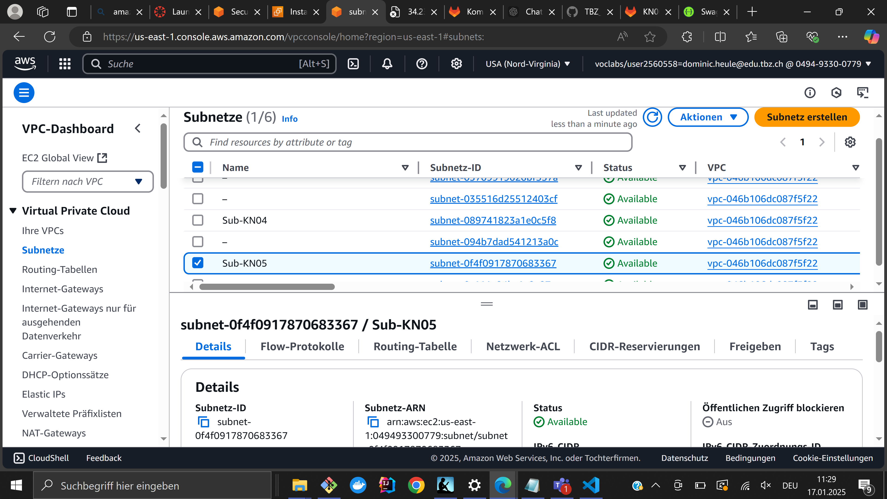
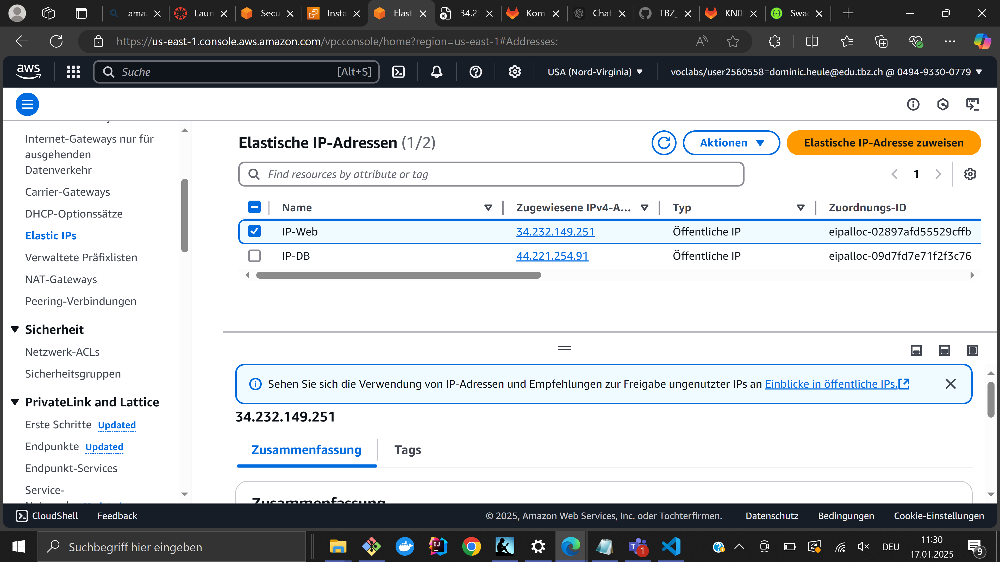
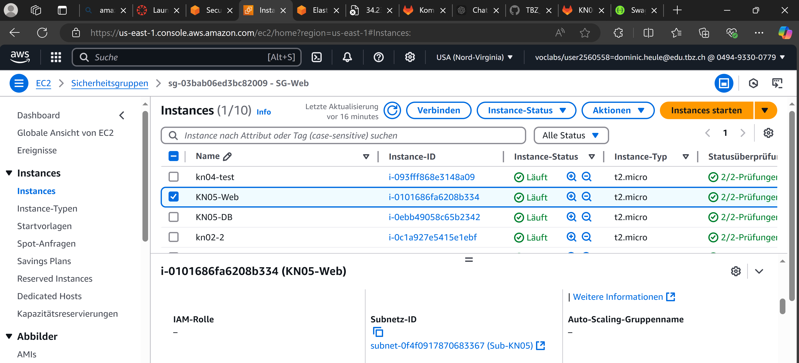
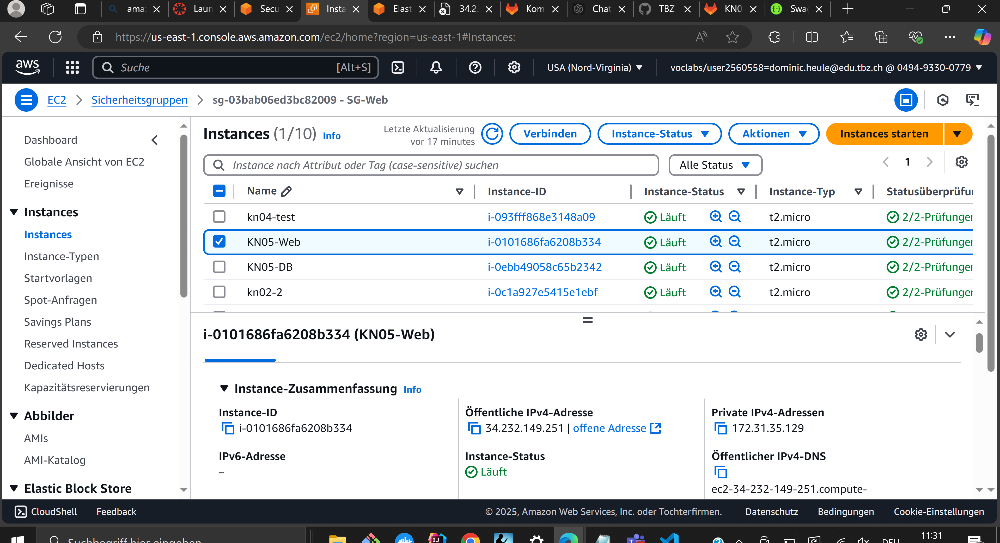
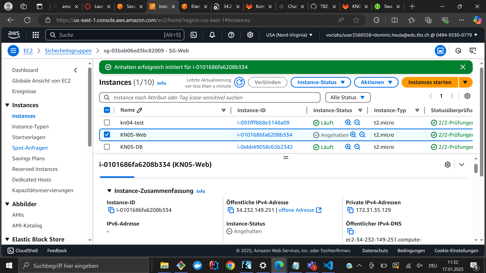
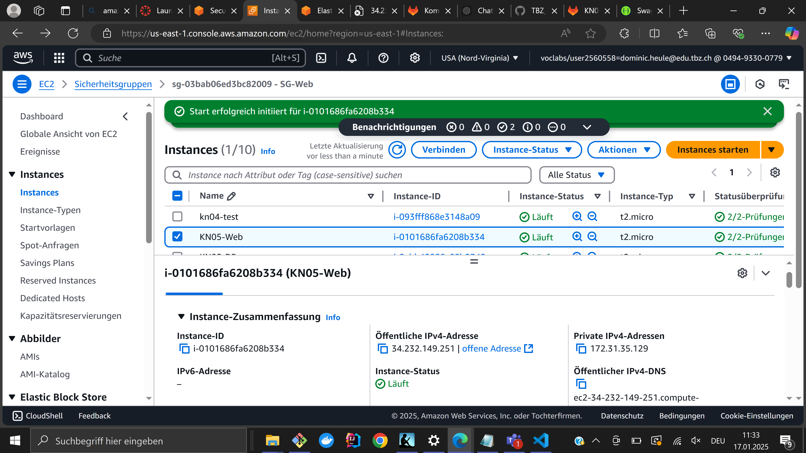

## KN05

### 1. Virtual Private Cloud (VPC)
Eine VPC ist ein privates Netzwerk innerhalb einer Cloud-Umgebung, das logisch isoliert ist. Sie dient als Basis für Cloud-Ressourcen wie Server, Datenbanken und Speicher. Die VPC hat einen definierten IP-Adressbereich (z. B. 10.0.0.0/16), in dem sich alle Ressourcen befinden.

Subnet
Ein Subnet ist ein kleinerer Bereich innerhalb des IP-Adressbereichs der VPC, der Ressourcen gruppiert und logisch trennt. Subnets können in verschiedenen Availability Zones (AZs) einer Region existieren. Sie ermöglichen eine genauere Kontrolle über die Platzierung von Ressourcen und deren Netzwerkzugriff.

Anzahl vordefinierter Subnets
Die Anzahl der Subnets hängt von der Architektur der VPC ab. Typischerweise gibt es mehrere vordefinierte Subnets:

Private Subnets: Für interne Ressourcen wie Datenbanken.
Public Subnets: Für Ressourcen, die über das Internet erreichbar sein sollen.
Die IP-Ranges der Subnets decken gemeinsam den gesamten IP-Adressbereich der VPC ab, dürfen sich aber nicht überschneiden.

Unterschied zwischen öffentlicher und privater IP
Öffentliche IP
Erreichbar von überall im Internet.
Wird für öffentlich zugängliche Ressourcen genutzt (z. B. Websites, APIs).
Beispiel: 52.123.45.67.
Private IP
Nur innerhalb eines privaten Netzwerks (z. B. der VPC) erreichbar.
Wird für interne Kommunikation zwischen Ressourcen genutzt.
Beispiel: 192.168.1.10.
Statische IP
Eine statische IP bleibt dauerhaft einer Ressource zugewiesen und ändert sich nicht bei Neustarts oder anderen Ereignissen. Sie wird oft genutzt für:

DNS-Einträge, um konsistente Zugriffe zu gewährleisten.
Verbindungen, die auf zuverlässigen IP-Adressen beruhen.
Ein Beispiel für eine statische öffentliche IP in AWS ist eine Elastic IP (EIP).
### 2. 
Die Server haben in der Subnetz Sub-KN05 (Ip: 127.31.0.0/20) erstellt.
Webserver: 127.32.0.50
DB-Server: 127.32.0.60

