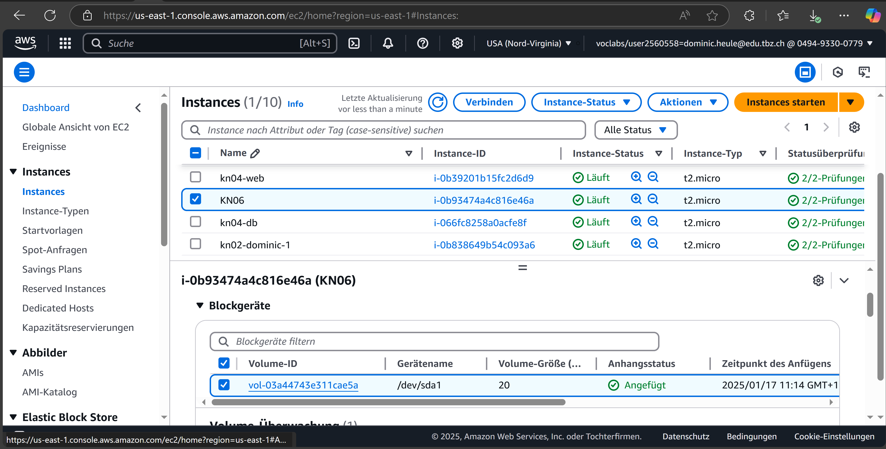
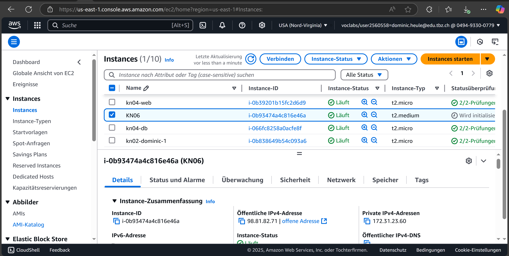
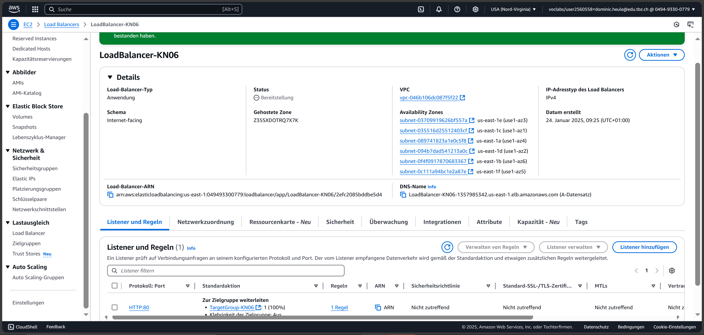
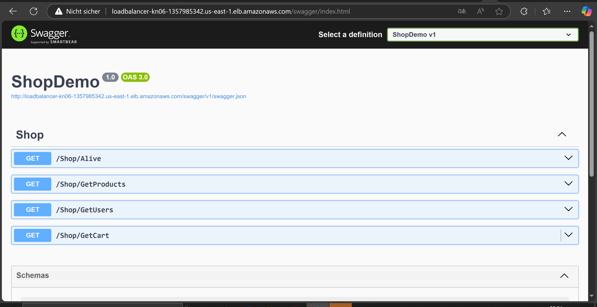
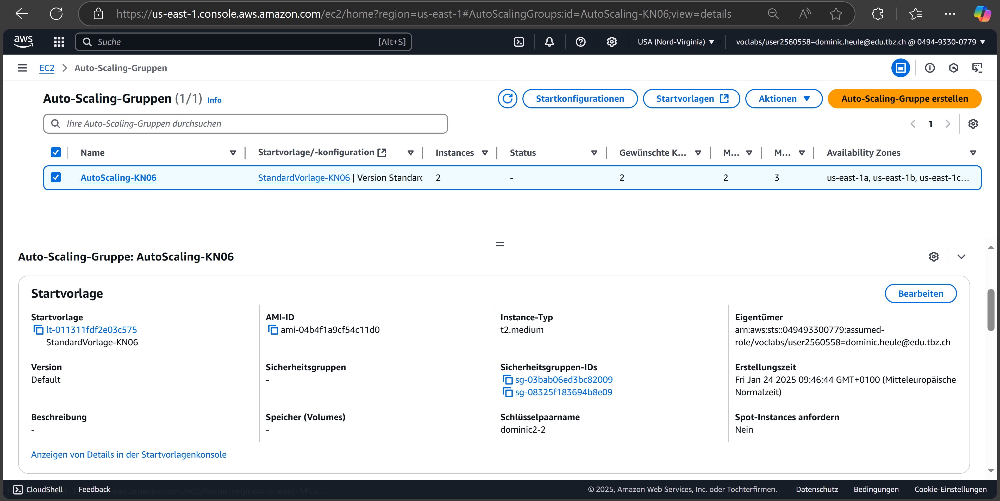

Um meine Applikation unter der Domain app.tbz-m346.ch erreichbar zu machen, muss die DNS-Konfiguration so angepasst werden, dass Anfragen an diese Domain an die URL des Load-Balancers weitergeleitet werden. Auf der Detailseite des Load-Balancers wird ein DNS-Record erstellt, der diese Weiterleitung definiert.

1. Disk auf 20 GB erweitern

Starte AWS und navigiere zu EC2.
Gehe zu Volumes unter dem EC2-Dashboard. Suche das Volumen, das deiner Instanz zugeordnet ist.
Wähle das Volumen aus und klicke auf Action > Modify Volume. Ändere die Grösse auf 20 GiB und klicke auf Modify

2. EC2-Instanz auf den Typ t2.medium skalieren

Für die Änderung des Instanztyps musst du die EC2-Instanz anhalten. Wähle die EC2-Instanz aus und klicke auf Instance State > Stop. Warte, bis der Zustand stopped angezeigt wird.
Wähle die Instanz aus und klicke auf Actions > Instance Settings > Change Instance Type. Wähle t2.medium aus. Speichere die Änderungen.
Starte die Instanz erneut über Instance State > Start

