# KN07

## A) Datenbank im PAAS Modell

PaaS und SaaS
Die Nutzung von PaaS oder SaaS für Datenbanken bietet zahlreiche Vorteile gegenüber einer eigenen Installation:

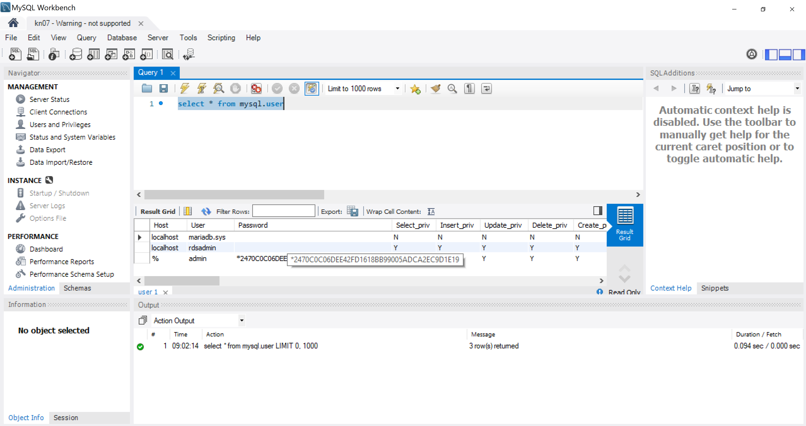

Weniger Aufwand: Anbieter übernehmen Einrichtung, Wartung, Updates und Backups.

Skalierbarkeit: Ressourcen passen sich automatisch an den Bedarf an.

Kosteneffizienz: Keine hohen Anfangsinvestitionen oder Betriebskosten, Bezahlung nach Nutzung.

Sicherheit: Integrierte und aktuelle Sicherheitslösungen.

Hohe Verfügbarkeit: Garantierte Redundanz und Ausfallsicherheit.

Schnelle Bereitstellung: Datenbanken können sofort genutzt werden.

Fokus auf Kerngeschäft: Keine Ablenkung durch technische Verwaltung.

PaaS und SaaS sind ideal für Projekte mit begrenzten Ressourcen oder flexiblen Anforderungen. Eine eigene Datenbank lohnt sich nur bei speziellen Anforderungen wie vollständiger Kontrolle oder strengen Datenschutzvorgaben.

## B) PAAS Applikation erstellen

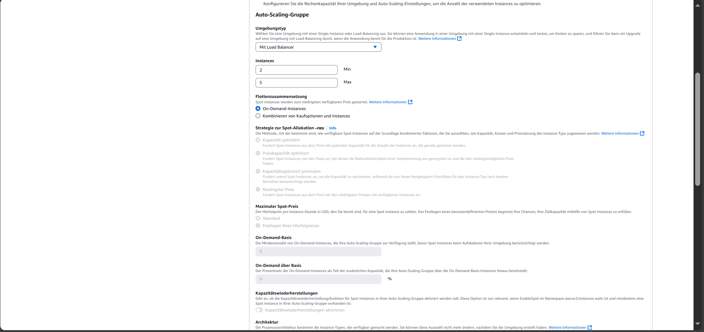
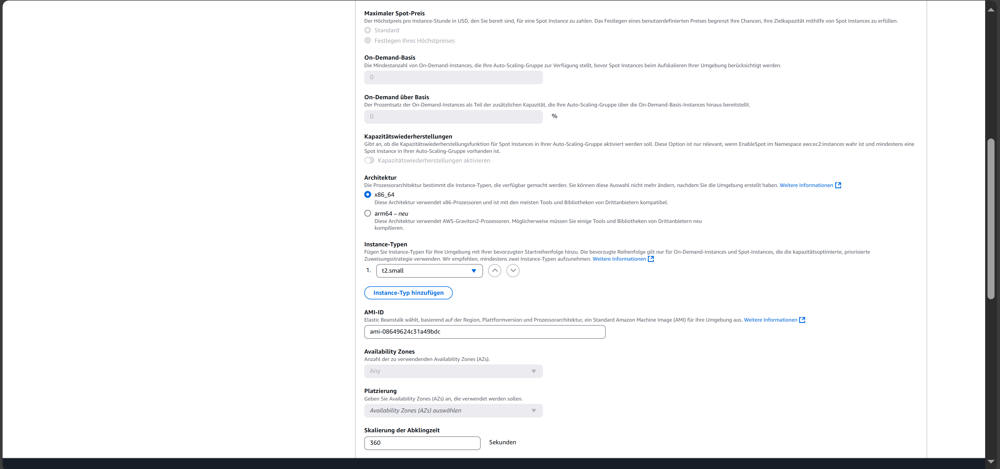
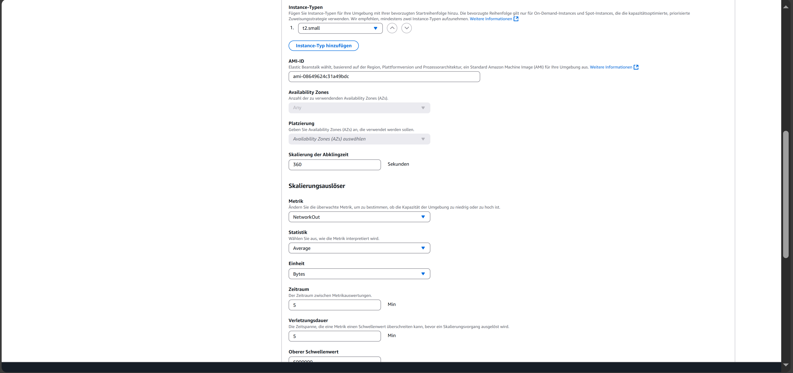
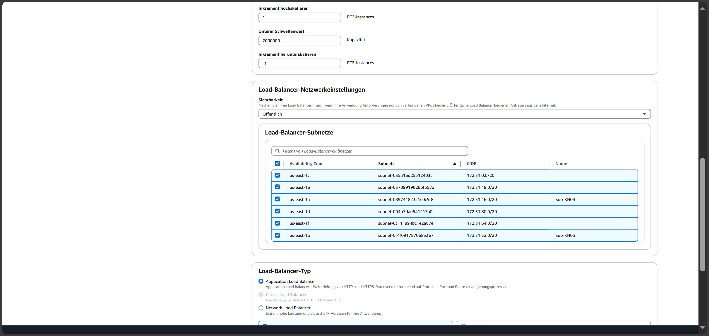
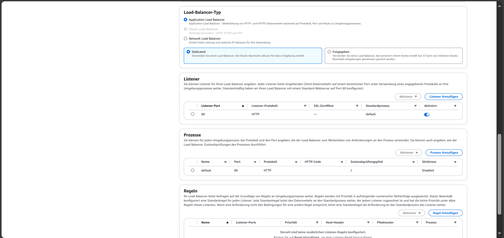
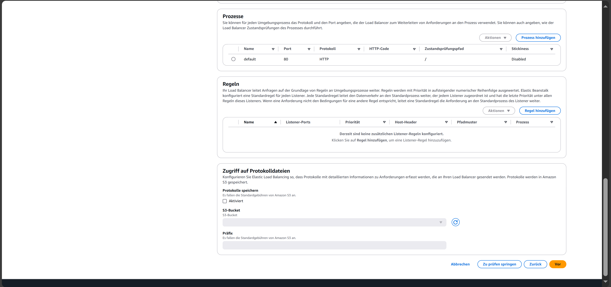
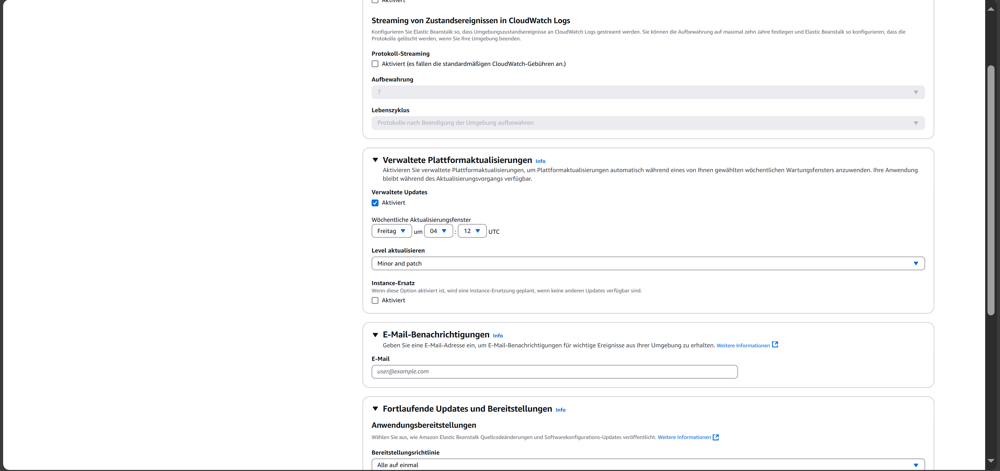
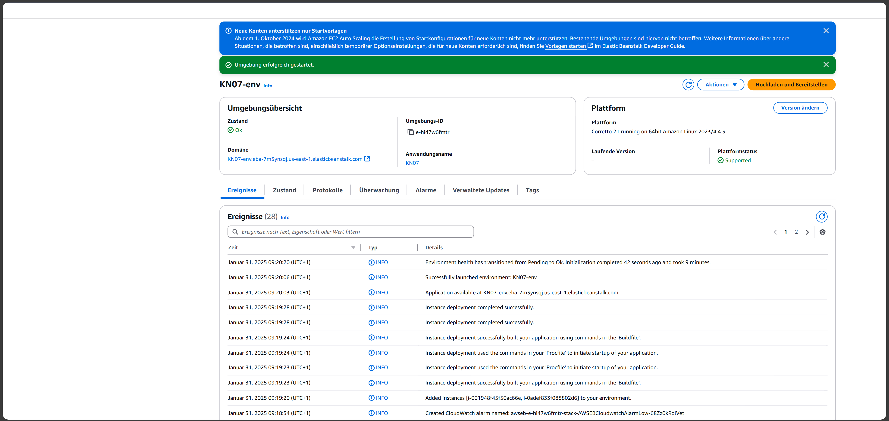
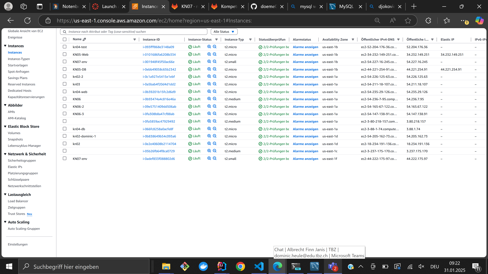
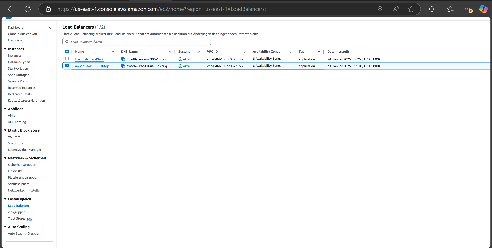
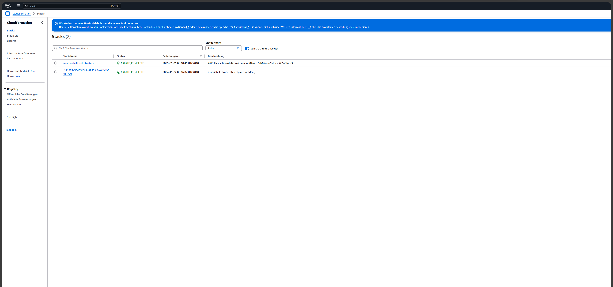
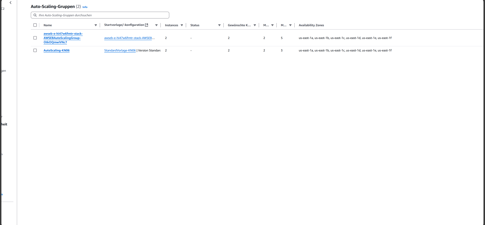